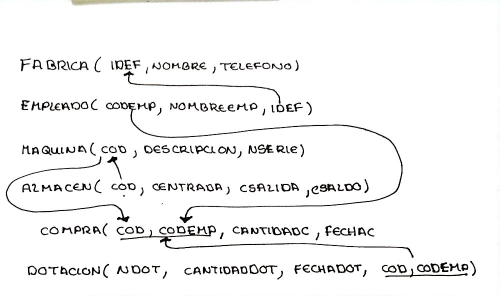

# Procedimientos Almacenados y Funciones — Resolución Parcial Simulada
> Base de Datos · _Stored Procedures con IN/OUT Parameters y Funciones · MySQL Workbench_

---

## Modelo Lógico Global de Datos

El siguiente esquema muestra las tablas y relaciones sobre las que se desarrollan los ejercicios.
El código fuente de la base de datos está disponible aquí: [Ver código SQL](./bd1.sql)

```
FABRICA   ( IDEF, NOMBRE, TELEFONO )

EMPLEADO  ( CODEMP, NOMBREEMP, IDEF )
               └── FK → FABRICA(IDEF)

MAQUINA   ( COD, DESCRIPCION, NSERIE )

ALMACEN   ( COD, CENTRADA, CSALIDA, CSALDO )
               └── FK → MAQUINA(COD)

COMPRA    ( COD, CODEMP, CANTIDADC, FECHAC )
               ├── FK → MAQUINA(COD)
               └── FK → EMPLEADO(CODEMP)

DOTACION  ( NDOT, CANTIDADDOT, FECHADOT, COD, CODEMP )
               └── FK → COMPRA(COD, CODEMP)
```



---

## Ejercicios

### Ejercicio 1 — Promedio de máquinas en compra por fábrica y empleado (año 2023)

**Enunciado:**
Crear un procedimiento almacenado que muestre el nombre de la fábrica, el nombre del empleado y el promedio de la cantidad de máquinas en compra del año 2023. Deberán mostrarse únicamente las fábricas y empleados que tengan por lo menos una máquina registrada en una compra.

**Resolución:** [Ver código SQL](./bd1.sql)

---

### Ejercicio 2 — Número de dotaciones por empleado para una máquina dada

**Enunciado:**
Crear un procedimiento almacenado que, dada la descripción de una máquina introducida por parámetro de entrada, muestre para cada empleado el número de dotaciones que contiene dicha máquina.

**Resolución:** [Ver código SQL](./bd1.sql)

---

### Ejercicio 3 — Total de máquinas en compra y en dotación de un empleado (parámetros OUT)

**Enunciado:**
Crear un procedimiento almacenado que obtenga cuántas máquinas en total se tienen registradas en compra y cuántas máquinas en total como dotación para un empleado dado. Se conoce el nombre del empleado. Las cantidades deben obtenerse en parámetros de salida.

**Resolución:** [Ver código SQL](./bd1.sql)

---

### Ejercicio 4 — Mayor cantidad de compra realizada por un empleado en una fecha (función)

**Enunciado:**
Crear una función que determine la mayor cantidad de compra realizada por un empleado para una determinada fecha. El nombre del empleado y la fecha se introducen como argumentos.

**Resolución:** [Ver código SQL](./bd1.sql)

---

[Volver al inicio](https://marcelamv2.github.io/SIS304-AUXILIATURA/)