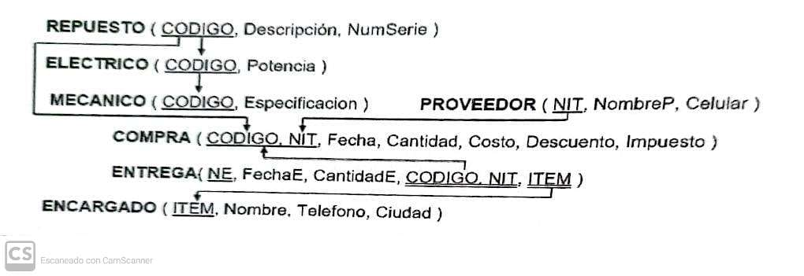

# Procedimientos Almacenados y Funciones — Resolución Parcial Simulada
> Base de Datos · _Stored Procedures con IN/OUT Parameters y Funciones · MySQL Workbench_

---

## Modelo Lógico Global de Datos

El siguiente esquema muestra las tablas y relaciones sobre las que se desarrollan los ejercicios.
El código fuente de la base de datos está disponible aquí: [Ver código SQL](./bd2.sql)

```
REPUESTO ( CODIGO, Descripción, NumSerie )
    ├── ELECTRICO ( CODIGO, Potencia )
    └── MECANICO  ( CODIGO, Especificacion )

PROVEEDOR ( NIT, NombreP, Celular )

COMPRA  ( CODIGO, NIT, Fecha, Cantidad, Costo, Descuento, Impuesto )
ENTREGA ( NE, FechaE, CantidadE, CODIGO, NIT, ITEM )

ENCARGADO ( ITEM, Nombre, Telefono, Ciudad )
```



---

## Ejercicios

### Ejercicio 1 — Costo total de compras por proveedor (año 2020)

**Enunciado:**
Crear un procedimiento almacenado que muestre el costo total a pagar — descontando el descuento y sumando el impuesto — de la compra de repuestos realizada por cada proveedor cuyo descuento no sea inferior al descuento más bajo de las compras del año 2020. Se deben incluir solamente los proveedores cuya cantidad total de compra sea por lo menos 10.

**Resolución:** [Ver código SQL](./bd2.sql)

---

### Ejercicio 2 — Cantidad de repuestos eléctricos y mecánicos comprados a un proveedor

**Enunciado:**
Crear un procedimiento almacenado que muestre la cantidad de repuestos eléctricos y la cantidad de repuestos mecánicos que se ha comprado a un proveedor en un día y mes del año actual en curso (obtenido del sistema). Se tienen como datos el NIT del proveedor, el día y el mes de la compra.

**Resolución:** [Ver código SQL](./bd2.sql)

---

### Ejercicio 3 — Cantidad de repuestos eléctricos entregados a dos encargados (parámetro OUT)

**Enunciado:**
Crear un procedimiento almacenado que devuelva en parámetro de salida la cantidad de repuestos eléctricos con una potencia superior a los 1000 watts que les han entregado a dos encargados cuyos nombres se tienen como datos.

**Resolución:** [Ver código SQL](./bd2.sql)

---

### Ejercicio 4 — Mayor cantidad de compra a un proveedor en una fecha (función)

**Enunciado:**
Crear una función que devuelva la mayor cantidad de compra de repuestos realizado a un proveedor en una determinada fecha. El nombre del proveedor y la fecha se introducen como argumentos.

**Resolución:** [Ver código SQL](./bd2.sql)

---

[Volver al inicio](https://marcelamv2.github.io/SIS304-AUXILIATURA/)